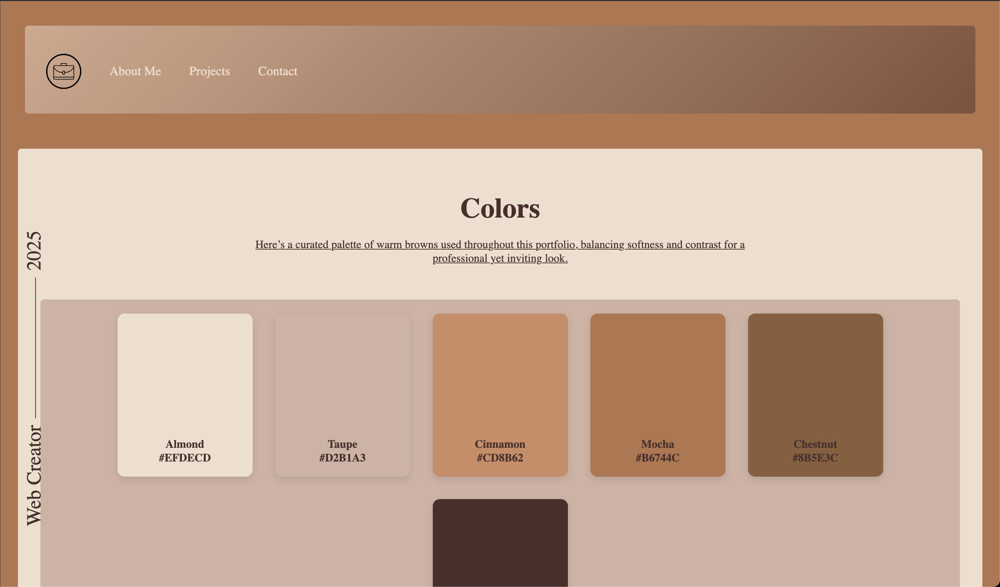
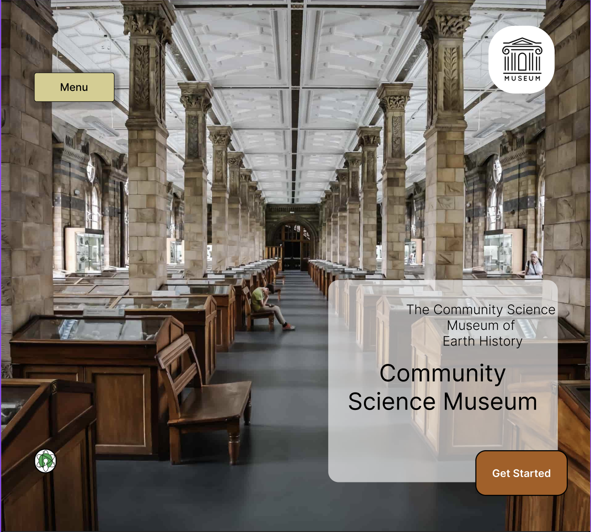
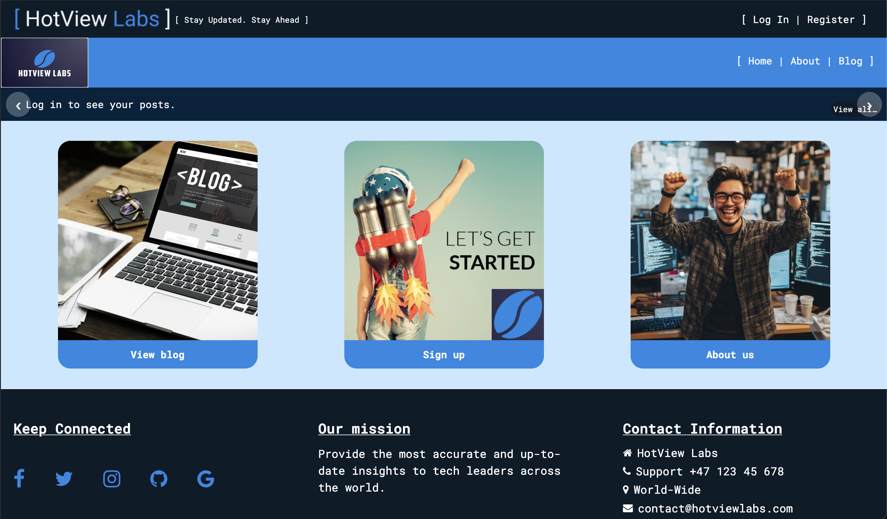

# 🎨 Portfolio – Mikkel August Andaas

Welcome to my portfolio!  
I'm a front-end developer passionate about creating clean, user-friendly, and responsive websites. Below are some of the featured projects I've built during my studies and personal learning journey.

---

## 🧪 Community Science Museum

A responsive, educational website built to engage young learners and families.  
It features exhibition pages, event listings, and contact forms — designed to promote science in an accessible way.

---

## 🎮 GameHub

A mock video game e-commerce platform where users can browse games, view details, and add titles to their cart.  
The design is fully responsive and uses modern layout techniques to enhance user experience.

---

## 📰 HotView Labs (Tech Blog)

A modern blog platform focused on the latest tech trends.  
Users can read, post, and manage blog entries, with a focus on structured content, filtering, and user-friendly design.

---
